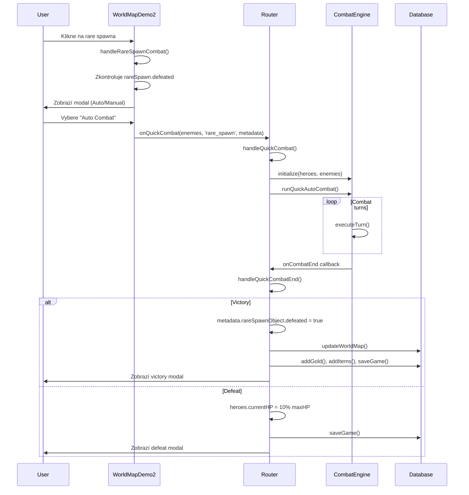

# Worldmap Combat Architecture

## 📖 Přehled

Tento dokument popisuje, jak funguje combat systém pro worldmap encounters (rare spawns, wandering monsters).

**Důležité:** Worldmap combat používá **stejný CombatEngine** jako dungeons! Neduplikuj logiku - combat je řízen z `Router.tsx`.

## 🏗️ Architektura

```
WorldMapDemo2.tsx (UI layer)
    ↓ (kliknutí na nepřítele)
    ↓ zobrazí modal s výběrem Auto/Manual
    ↓ (kliknutí na Auto/Manual Combat)
    ↓ volá onQuickCombat callback
    ↓
Router.tsx (Combat controller)
    ↓ handleQuickCombat() - inicializuje combat
    ↓ CombatEngine.initialize()
    ↓ runQuickAutoCombat() nebo manual mode
    ↓ (combat probíhá...)
    ↓ handleQuickCombatEnd() - zpracuje výsledek
    ↓
    ↓ VICTORY:
    ↓   - Označí nepřítele jako defeated
    ↓   - Přidá XP, gold, items
    ↓   - Uloží změny do DB
    ↓
    ↓ DEFEAT:
    ↓   - Nastaví hrdinům 10% HP
    ↓   - Uloží změny do DB
```

## 📁 Klíčové soubory

### 1. **Router.tsx** - Combat Controller
**Cesta:** `src/Router.tsx`

**Zodpovědnost:**
- Přijímá combat request z WorldMapDemo2
- Inicializuje CombatEngine s heroes a enemies
- Řídí combat flow (auto/manual)
- Zpracovává výsledek (victory/defeat)
- **Označuje nepřítele jako defeated POUZE po vítězství**

**Klíčové funkce:**

#### `handleQuickCombat(enemies, combatType, metadata)`
**Řádky:** 318-358

```typescript
const handleQuickCombat = (
  enemies: Enemy[],
  combatType: 'rare_spawn' | 'wandering_monster',
  metadata?: any
) => {
  // Nastaví combat state
  setCurrentEnemies(enemies);
  setQuickCombatMetadata(metadata); // ← DŮLEŽITÉ: obsahuje rareSpawnObject/monsterObject
  setCombatActive(true);

  // Inicializuje CombatEngine
  combatEngine.initialize(activeHeroes, enemies);
  combatEngine.isManualMode = (metadata?.mode === 'manual');
  combatEngine.onCombatEnd = handleQuickCombatEnd; // ← callback po skončení

  // Spustí combat
  if (isManual) {
    // Manual mode - čeká na input hráče
  } else {
    runQuickAutoCombat(); // Auto mode - běží smyčka
  }
}
```

#### `handleQuickCombatEnd()`
**Řádky:** 363-470

```typescript
const handleQuickCombatEnd = async () => {
  // Zkontroluje, jestli všichni hrdinové zemřeli
  const allHeroesDead = gameState.activeParty.every(hero => !hero.isAlive);

  if (allHeroesDead) {
    // DEFEAT
    gameState.activeParty.forEach(hero => {
      hero.currentHP = Math.max(1, Math.floor(hero.maxHP * 0.1)); // 10% HP
      hero.isAlive = true;
    });
    await gameActions.saveGame();
    setQuickCombatDefeat(true);
    return;
  }

  // VICTORY! ← TEPRVE TEĎ označíme nepřítele jako defeated
  if (quickCombatMetadata) {
    if (quickCombatMetadata.rareSpawnObject) {
      quickCombatMetadata.rareSpawnObject.defeated = true;
      console.log('🎯 Rare spawn marked as defeated');
    }
    if (quickCombatMetadata.monsterObject) {
      quickCombatMetadata.monsterObject.defeated = true;
      console.log('🎯 Wandering monster marked as defeated');
    }
    // Uložíme změny do worldmap
    if (gameState.worldMap) {
      await gameActions.updateWorldMap({ ...gameState.worldMap });
    }
  }

  // Přidáme rewards
  const goldReward = combatEngine.lootReward?.gold || 0;
  const xpReward = /* vypočítá XP */;

  await gameActions.addGold(goldReward);
  // Přidá items do inventory
  // Uloží heroes s novým XP
  await gameActions.saveGame();

  // Zobrazí victory modal
  setQuickCombatVictory({ gold, xp, levelUps, items });
}
```

### 2. **WorldMapDemo2.tsx** - UI Layer
**Cesta:** `src/components/WorldMapDemo2.tsx`

**Zodpovědnost:**
- Zobrazuje modal s výběrem Auto/Manual combat
- Volá `onQuickCombat` callback (předaný z Router.tsx)
- **NEOZNAČUJE** nepřítele jako defeated - to dělá Router!

**Klíčové části:**

#### Rare Spawn Combat Handler
**Řádky:** 646-689

```typescript
const handleRareSpawnCombat = async (rareSpawn: RareSpawn) => {
  // Zkontroluje, jestli už není defeated
  if (rareSpawn.defeated) {
    setShowMessageModal(t('worldmap.rareSpawnDefeated'));
    return;
  }

  // Vygeneruje enemies
  const { generateRareSpawnEncounter } = await import('../engine/combat/NamedEnemies');
  const enemies = generateRareSpawnEncounter(rareSpawn.enemyName, rareSpawn.enemyLevel);

  // Zobrazí modal s výběrem combat mode
  setShowQuickCombatModal({
    enemies,
    enemyName: `${rareSpawn.name} - ${rareSpawn.enemyName}`,
    enemyLevel: rareSpawn.enemyLevel,
    difficulty: rareSpawn.guaranteedDrop || 'Elite',
    combatType: 'rare_spawn',
    metadata: {
      name: rareSpawn.name,
      guaranteedDrop: rareSpawn.guaranteedDrop,
      position: rareSpawn.position,
      rareSpawnObject: rareSpawn  // ← DŮLEŽITÉ: předá celý objekt
    }
  });
}
```

#### Combat Mode Selection Modal
**Řádky:** 1599-1632

```typescript
<ModalButtonGroup>
  <ModalButton
    onClick={() => {
      const { enemies, combatType, metadata } = showQuickCombatModal;
      setShowQuickCombatModal(null);

      // POUZE volá callback - NEOZNAČUJE jako defeated!
      if (onQuickCombat) {
        onQuickCombat(enemies, combatType, { ...metadata, mode: 'auto' });
      }
    }}
    variant="primary"
  >
    ⚡ Auto Combat
  </ModalButton>

  <ModalButton
    onClick={() => {
      const { enemies, combatType, metadata } = showQuickCombatModal;
      setShowQuickCombatModal(null);

      // POUZE volá callback - NEOZNAČUJE jako defeated!
      if (onQuickCombat) {
        onQuickCombat(enemies, combatType, { ...metadata, mode: 'manual' });
      }
    }}
    variant="secondary"
  >
    🎮 Manual Combat
  </ModalButton>
</ModalButtonGroup>
```

### 3. **CombatEngine.ts** - Core Combat Logic
**Cesta:** `src/engine/combat/CombatEngine.ts`

**Zodpovědnost:**
- Řídí turn-based combat
- Počítá damage, HP, initiative
- Podporuje auto i manual mode
- Generuje loot rewards
- **Používá se jak pro dungeons, tak pro worldmap!**

## ⚠️ DŮLEŽITÁ PRAVIDLA

### ✅ CO DĚLAT

1. **Vždy používej existující CombatEngine** - je sdílený mezi dungeons a worldmap
2. **Označuj nepřítele jako defeated POUZE v `handleQuickCombatEnd()`** po vítězství
3. **Předávej metadata s objektem** (`rareSpawnObject`, `monsterObject`) do `onQuickCombat`
4. **Ukládej změny do DB** po combat completion (`gameActions.updateWorldMap()`)

### ❌ CO NEDĚLAT

1. **NEVYTVÁŘEJ nový CombatEngine** - použij ten z Router.tsx
2. **NEOZNAČUJ nepřítele jako defeated PŘED combat** - to dělá až `handleQuickCombatEnd()`
3. **NEDUPLIKUJ combat logiku** - vše je v CombatEngine a Router.tsx
4. **NEZAPOMEŇ na metadata** - bez `rareSpawnObject`/`monsterObject` se nepřítel neoznačí jako defeated

## 🔄 Flow Diagram



## 🐛 Časté chyby a řešení

### Problém: Nepřítel se neoznačuje jako defeated
**Příčina:** Metadata neobsahují `rareSpawnObject` nebo `monsterObject`

**Řešení:** V `handleRareSpawnCombat()` nebo `handleWanderingMonsterCombat()` zkontroluj, že metadata obsahují:
```typescript
metadata: {
  rareSpawnObject: rareSpawn  // ← MUSÍ být zde!
}
```

### Problém: Combat se nespustí
**Příčina:** `onQuickCombat` callback není předán do WorldMapDemo2

**Řešení:** V Router.tsx zkontroluj, že WorldMapDemo2 má prop:
```typescript
<WorldMapDemo2
  onQuickCombat={handleQuickCombat}  // ← MUSÍ být zde!
/>
```

### Problém: Nepřítel je defeated okamžitě bez combatu
**Příčina:** Kód v onClick handleru označuje nepřítele jako defeated PŘED voláním `onQuickCombat`

**Řešení:** Odstraň jakýkoliv kód, který mění `defeated` flag před/během `onQuickCombat`:
```typescript
// ❌ ŠPATNĚ
onClick={() => {
  rareSpawn.defeated = true;  // <- Tohle NESMÍ být zde!
  onQuickCombat(enemies, ...);
}}

// ✅ SPRÁVNĚ
onClick={() => {
  onQuickCombat(enemies, combatType, metadata);  // Pouze zavolej callback
}}
```

## 📊 State Flow

```
Initial State:
├─ rareSpawn.defeated = false
├─ heroes.currentHP = (různé)
└─ combat není aktivní

User clicks "Auto Combat":
├─ WorldMapDemo2 zavolá onQuickCombat()
├─ Router.handleQuickCombat() spustí CombatEngine
├─ Combat probíhá (heroes a enemies bojují)
└─ CombatEngine volá onCombatEnd callback

Victory State:
├─ rareSpawn.defeated = true  ← TEPRVE TEĎ!
├─ heroes.currentHP = (po combatu)
├─ inventory += items
├─ gold += goldReward
└─ heroes.experience += xpReward

Defeat State:
├─ rareSpawn.defeated = false  ← Zůstává false!
├─ heroes.currentHP = 10% maxHP
└─ combat ukončen
```

## 🔍 Debugging Tips

1. **Zkontroluj console logy:**
   - `⚔️ Quick combat starting` - combat začíná
   - `✅ Quick combat completed` - combat skončil
   - `🎯 Rare spawn marked as defeated` - nepřítel označen jako defeated

2. **Zkontroluj metadata:**
```typescript
console.log('📋 Combat metadata:', metadata);
// Mělo by obsahovat: rareSpawnObject nebo monsterObject
```

3. **Zkontroluj callback:**
```typescript
console.log('onQuickCombat callback:', onQuickCombat);
// Nesmí být undefined!
```

## 📚 Související dokumentace

- [CombatEngine.ts](../src/engine/combat/CombatEngine.ts) - Core combat logic
- [Router.tsx](../src/Router.tsx) - Combat controller
- [WorldMapDemo2.tsx](../src/components/WorldMapDemo2.tsx) - UI layer

---

**Autor:** Roman Hlaváček - rhsoft.cz
**Copyright:** 2025
**Poslední update:** 2025-11-13
